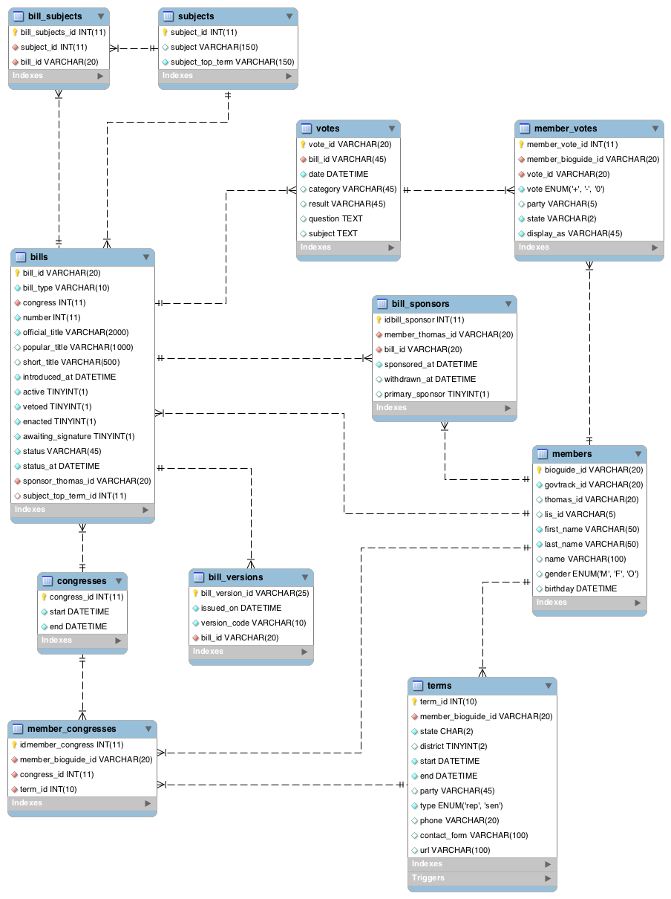

:question::warning::boom: ***work in progress*** :construction::zap::exclamation:

# What is this? Why?

The goal is to use [data](https://www.govtrack.us/developers/data) from
[govtrack.us](https://www.govtrack.us/) and some fancy [d3js](http://d3js.org/)
visualizations to create a multi-device, collaborative environment that allows
for exploration and discovery inside a large (publicly available) dataset.

This project tries to both explore new/novel data visualizations and
interactions as well as expose already available data to provide actionable
insights and increased transparency in government.

This work is ***currently in progress*** at the
[Information Interfaces Lab](http://www.cc.gatech.edu/gvu/ii/) in the
[GVU Center](http://www.gvu.gatech.edu/) at
[Georgia Tech](http://www.gatech.edu/).

## What are you using?

So far:
 - [MySQL](https://www.mysql.com/)
 - [Elasticsearch](https://www.elastic.co/products/elasticsearch)
 - [Backbone.js](http://backbonejs.org/) for the client-side web
 - [d3js](http://d3js.org/) to do some neat visualizations
 - [Node.js](https://nodejs.org/en/) and [Express.js](http://expressjs.com/en/index.html) framework
 - miscellaneous python scripts to pre-process and bulk import data

Eventually:
 - probably [Firebase](https://www.firebase.com/) to facilitate easy real-time
 communications/collaboration between multiple devices

## Getting Started

1. Download data from [GovTrack](https://www.govtrack.us/developers/data) into
  the `data/` directory (see more details in the README there).

2. Install [MySQL](https://www.mysql.com/) (and maybe
  [MySQL Workbench](https://www.mysql.com/products/workbench/)) and
  [Elasticsearch](https://www.elastic.co/products/elasticsearch)
    - On Mac OS X: `brew install mysql elasticsearch`

3. Import the schema from `data/utils/congressvis_schema.sql`

4. Use `data/utils/mysql_import.py` to import data into MySQL (see documentation by
  running `python data/utils/mysql_import.py -h` and refer to README in data folder)

5. Install node dependencies and bower dependencies with `npm install` and `bower install`

6. Copy `config-example.js` to `config.js` and fill in with the proper credentials

7. Start the server with `npm start` (which runs the script `./bin/www`)

8. Navigate to http://localhost:3000 to confirm Node/Express is running

9. *???*

10. *Relax.* 

## Project/Filesystem Overview

**Note:** This project layout was initially generated with the
[`express-generator`](http://expressjs.com/en/starter/generator.html)
and mostly follows standard Express.js conventions.

### Directories

 - `data/` raw data from govtrack (see README there)
  - `data/utils/` python scripts to quickly import data files into MySQL
 - `api/` handlers and converters that talk with the database (ORM-esque)
 - `public/` (static) client-side resources
  - `public/style` -> stylesheets
  - `public/scripts` -> client-side javascript ex) Backbone application,
  d3js visualizations
 - `routes/` express routers (and a bit of database connection logic)
 - `views/` view templates (handlebars) that are (mostly) rendered server-side

### Files of Interest
 - `bin/www` node server startup script
  - can be called with either `npm start` (recommended) or `./bin/www` from
  project root
 - `config.js` deployment specific settings and sensitive information
 (credentials etc.)
 - `app.js`

### Database Schema

**Todo:** written documentation for database schema

## API Documentation

**Todo:** write API, then document
